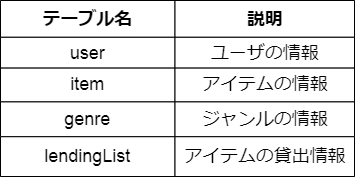
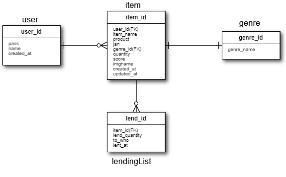
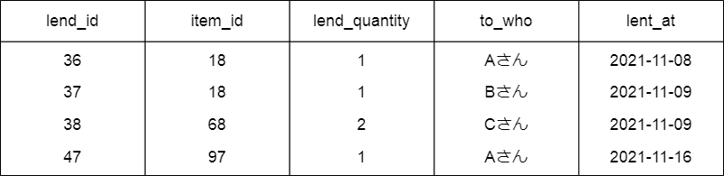

# 概要
ゲームや本等のアイテムを登録して管理するアプリ


# 制作背景
何か要らないアイテムを駿河屋等に売る時に、ダンボールや収納ボックスから現物の確認をしてどれを売るかを決めるといった行為に煩わしさを感じてました。<br>そこでアイテムを管理できるアプリがあれば便利だと思い制作しました。

# 使用技術
Java(Servlet)

JSP

MySQL 8.0.23

HTML/CSS

jQuery 3.6.0

Bootstrap 3.3.7

JUnit 5
<br>
<br>
<br>
jQueryはAjaxといった非同期通信、アイテムリスト画面での各アイテムの領域の高さを揃える為に使用しました。<br>Bootstrapは主にページネーション機能の雛型に使用しました。

# 機能一覧
ログイン、ログアウト機能

サインアップ機能

アイテム登録、編集、削除機能

アイテム貸出、返却機能

アイテム貸出リスト閲覧機能

評価をつける機能

画像アップロード機能

アイテム検索機能(文字列部分一致検索、ジャンル検索、非同期通信を使った文字列部分一致検索機能)

# DB設計
テーブル



ER図



# 工夫した点
・アイテム貸出機能の実装<br>
当初はアイテムを登録して管理するだけでしたが、アイテムを誰かに貸す場合もあると思うので実装しました。


<br>
<br>
また、貸出数が1以上なら削除ボタンをクリックできないようにし、編集画面でも所持数を貸出数未満の数にはできないようにしました。<br>


<br>
<br>
<br>
<br>
・絞り込み検索
文字列部分一致検索とジャンル検索といった絞り込み機能の実装。また、それらの機能でもアイテム数が多い場合はページネーションを表示するようにしました。
<br>
<br>
<br>
<br>
・非同期通信
アイテム登録時、そのアイテム名が既にDBに登録されているかを素早くチェックできたら便利だと思い、Ajaxを使った非同期通信での処理を実装しました。


# 苦労した点
・ページネーションの実装

SQLでLIMITとOFFSETを使って実装する所まではわかっていましたが、その後どうやって実装するかがどうしてもわからなかったのでネットで方法を探りました。<br>結果、無事実装する事に成功しました。
<br>
<br>

おおまかな流れとしては

ログイン後やページ番号押下<br>
↓<br>
サーブレットクラスのメソッド<br>
ページ番号を取得。取得できない場合は1をセット<br>
↓<br>
DBとやり取りする為DAOクラスのメソッドを呼び出す<br>
↓<br>
DBからアイテム数を取得<br>
↓<br>
DBからアイテムを取得する際にレコード群から取得数と取得の開始位置を指定する為、SQL文にはLIMITとOFFSETを条件に使ってアイテムを取得<br>
↓<br>
ページネーション作成の為の情報をセット<br>
↓<br>
JSP側でページネーション作成(Bootstrapのページネーションの雛型( https://getbootstrap.jp/docs/5.0/components/pagination/ )　を使用)
　

(ソースコード一部抜粋)

```

	/**
	 * ページネーション作成の為の情報をセット<br>
	 * ページ数が20ページ以上かどうかでページネーションの表示が変わる(20ページ以上ならば先頭ページへのリンクと末尾ページへのリンクが付加される)<br>
	 * ページネーション情報を二次元配列pagerにセットする時、1次元目にはページネーションのリンク(<<と>>も含む)の数(位置)を、<br>
	 * 2次元目にはリンク名(jspでページネーションを作成する際、liタグのclass属性値に指定)、リンク先ページ、表示文字の3要素をセット<br>
	 * @param info アイテムリスト画面作成の情報
	 */
	protected static void paginationInfoSet(ItemListScreenInfo info) {

		int pageCount = info.getTotal() % info.getLIMIT() == 0 ? info.getTotal() / info.getLIMIT() : info.getTotal() / info.getLIMIT() + 1;

		String[][] pager;

		if(pageCount < 20) {

			pager = new String[pageCount][];
			for(int i = 0; i < pageCount; i++) {

				pager[i] = new String[] {info.getPageNo() == i + 1 ? "active" : "", i + 1 + "", i + 1 + ""};

			}

		} else {

			// 現在のページ番号の前後にリンク(最大5件)を設定
			int before = Math.min(info.getPageNo() - 1, 5);
			int after = Math.min(pageCount - info.getPageNo(), 5);
			int len = 1 + before + 1 + after + 1;

			pager = new String[len][];

			// 先頭ページへのリンク
			pager[0] = new String[] {info.getPageNo() == 1 ? "disable" : "", 1 + "", "<<"};


			for(int i = 1, page = info.getPageNo() - before; i < len - 1; i++, page++) {

				pager[i] = new String[] {page == info.getPageNo() ? "active" : "", page + "", page + ""};

			}


			// 末尾へのリンク
			pager[len - 1] = new String[] {info.getPageNo() == pageCount ? "disable" : "", pageCount + "", ">>"};

		}

		info.setPager(pager);

	}
 
 ```

# 苦労した点2
・アイテム詳細画面で特定のアイテムの情報(アイテム名やメーカー、所持数など)と貸出数を表示する際にSQL文を使ってitemテーブルとgenreテーブルとlendingListテーブルから情報を持ってくる必要があり、この時のSQL文の記述に苦労しました。例えばlendingListが次のような状態の時,



アイテムIDが18のアイテムの詳細画面では貸出数を2と表示するにはSQLをどう記述するべきか悩みました。
そこで、2パターンのSQL文を例に挙げます。※パターン1の取得するカラム数は一部のみとしました。

パターン1: SUM関数と左外部結合を使う

```

 SELECT item.item_id, genre.genre_name, SUM(lendingList.lend_quantity) as lend_quantity, lendingList.to_who FROM item
  JOIN genre ON item.genre_id = genre.genre_id
  LEFT JOIN lendingList ON item.item_id = lendingList.item_id
  WHERE item.user_id = 'ユーザID' AND item.item_id = アイテムID;
 
```

これが一番理想的かと思いましたが、存在しないユーザIDやアイテムIDを指定すると全カラムにNULLが入ったレコードを取得してしまいます。(SUM関数は計算対象のデータがないとNULLを格納する、そして他のカラムも格納する値がないのでNULLが格納され結果NULLのみが入ったレコードが返ってくる)<br>


パターン2:SQL文を2つに分ける

```

SELECT item.item_id, item.item_name, item.product, item.jan, genre.genre_name, item.quantity, item.score, item.imgname, item.created_at, item.updated_at FROM item
 JOIN genre ON item.genre_id = genre.genre_id
 WHERE item.item_id = アイテムID;

```

```

SELECT SUM(lend_quantity) AS lend_quantity FROM lendingList WHERE item_id = アイテムID;

```


パターン1はSQL文の発行数が1つ少ないというメリットがありますが、全カラムにNULLが格納されて返ってくる可能性もあり気持ち悪さを感じたので、一番無難そうなパターン2を選択しました。

<br>
<br>

データベース構築やSQL文について不足な点が多いと感じ、もっと上手なやり方があるのではないかと思いました。また、アプリ作りでデータベースやSQLはとても重要だと実感し、これからも沢山勉強したいと思いました。

# こだわった点
CSSについても学習したいと思い、CSSフレームワークの使用は最小限にして、一から記述してデザインを施しました。

Webアプリの基本的な知識の理解を深める為フレームワークを使わずサーブレットで実装しました。今後フレームワークを触れる機会があると思うのでその時はスムーズに移行できればと思います。

テストコード実装。実務でもテストを必ず実装するのでその事を想定してJUnitで単体テストを実装しました。

フロントエンドとバックエンドとで分業しやすくする事を想定して、jspではスクリプト式を使わずアクションタグとEL式を使用しました。

# 意識した点
ソースコードの可読性

例えばコメントの数が多いとコードが読みづらくなるのでクラスブロックやメソッドブロックの上にまとめて記入しました。<br>また、メソッドブロック内でも個人的に重要な個所にはコメントを付けました。

# 課題点反省点

GitHubの使い方<br>最初はログ感覚でコミットしていたのでタイミングをもっと考慮するべきでした。今後はひとまとまりの機能や処理の実装後にコミットしていく事を意識していきます。

テーブルitemの設計<br>アイテム編集と同時に評価を付けれるようにした為、カラムscoreをitemテーブルに含むようにしましたが、今後Amazonのようなレビュー機能を実装する事もプランに入ってるので、別テーブルで実装するべきかと思いました。


# 感想
サーブレットを使ったアプリはこれで2つ目となります。今回は0から作った完全オリジナルアプリなので中々達成感はありました。テーブル数が少なく最低限の事しかできていない印象もありますが、Ajaxを使った非同期通信等興味のある分野の技術を取り入れることが出来て良かったです。

これで終わりではなく今後も更に使いやすくする為にアップデートしていきたいです。今後も自分や誰かの為になるアプリを作っていきたいと思います。<br>まだまた至らない点が多いと感じたのでたくさん学んでいきたいです。
